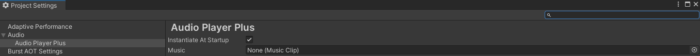

# [AudioPlayerSettings](../Runtime/AudioPlayerSettings.cs)

Class in `Incantium.Audio` | Assembled in [`Incantium.Audio`](../README.md)

Extends [`ScriptableObject`](https://docs.unity3d.com/ScriptReference/ScriptableObject.html)

## Description

The AudioPlayerSettings are the general settings for the Audio Player Plus package. This class is visible in the Unity
Project Settings window under "Audio -> Audio Player Plus".

Within these settings, you can check if there should be a new [audio player](AudioPlayer.md) instantiated at the 
starting of the game and if it should play a default audio clip.

## Variables

### :lock: `bool` instantiateAtStartup

Whether to instantiate a new [audio player](AudioPlayer.md) at the start of the game.

### :lock: [`MusicClip`](MusicClip.md) music

The audio clip to play at awake. Keep this field empty to not play anything at startup.
