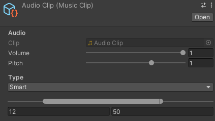

# [MusicClip](../Runtime/MusicClip.cs)

Class in `Incantium.Audio` | Assembled in [`Incantium.Audio`](../README.md)

Extends [`ScriptableObject`](https://docs.unity3d.com/ScriptReference/ScriptableObject.html)

## Description

The MusicClip is an extension to Unity's [audio clip](https://docs.unity3d.com/ScriptReference/AudioClip.html). With the
MusicClip, you can denote how it must be played by the [audio player](AudioPlayer.md) with the correct volume, pitch,
and looping points.

A MusicClip instance can be created by right-clicking on an audio clip in Unity and then selecting "Create -> Audio -> 
Music Clip".

## Variables

### :green_book: [`AudioClip`](https://docs.unity3d.com/ScriptReference/AudioClip.html) clip

The audio clip, altered by volume, pitch, and smart looping.

### :green_book: [`MusicType`](MusicType.md) type

The type of audio clip. This will influence how the audio clip will be played by the [audio player](AudioPlayer.md).

### :green_book: `float` volume

The maximum volume of the audio clip after fading in.

### :green_book: `float` pitch

The pitch of the audio clip, which influences the total length of the audio clip. This in turn will speed up/down the 
audio clip.

### :green_book: `float` start

The start boundary of the main loop in seconds.

### :green_book: `float` end

The end boundary of the main loop in seconds.

## Methods

### :green_book: `void` Play(`float`, [`FadeType`](FadeType.md))

Start playing a new audio clip with an amount of seconds between audio clips and a fade typing. How the audio clip will
be played is determined by its [type](MusicType.md).
